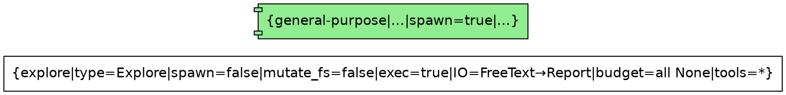
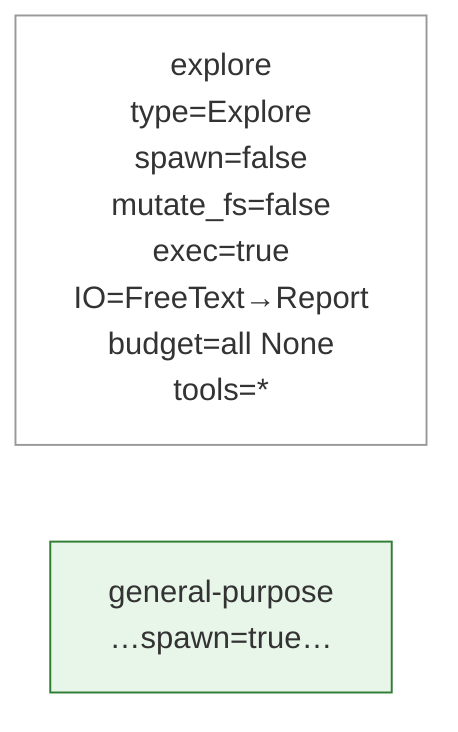

# Design: Org-Graph Contract Viewer

本设计是对 open 阶段 `openspec/changes/org-graph-contract-viewer/design.md`（高层框架）的**深度技术细化**，不替代它。canonical spec 为该 change 的 OpenSpec delta spec。

## 1. 目标与范围

把内置 `NodeRegistry`（5 个 `NodeContract` × 五维：capability / permission / budget / IO shape / identity）渲染成 `table` / `dot` / `mermaid` / `json` 四种可读视图，供 CLI 审计与文档导出。纯只读、纯新增、零运行时副作用。详见 `proposal.md` / `specs/org-graph-contract-viewer/spec.md`。

## 2. 架构

```
wgenty-code org-graph contracts [--format table|dot|mermaid|json]
   │  handler 经 AppState 取 settings.subagent (SubagentLimits)
   ▼
NodeRegistry::builtin(&subagent_limits).iter()  ──▶  Vec<&NodeContract>（canonical order）
   │
   ▼  纯函数
render(registry, format) -> String            // src/org_graph/render.rs
   ├── render_table    手写 format! 宽度（仿 src/cli/subagent.rs）
   ├── render_dot      Graphviz record 节点 + 视觉编码
   ├── render_mermaid  mermaid 节点卡 + classDef
   └── render_json     serde_json::to_string_pretty（NodeContract 已 Serialize）
```

三处新增/扩展，全部 additive：
- `NodeRegistry::iter()`（`src/org_graph/registry.rs`）— 新只读方法。
- `src/org_graph/render.rs` — 新纯函数模块。
- `src/cli/mod.rs` + main dispatch — 新顶层 `OrgGraph` 命令组。

## 3. 关键设计决策

### 3.1 `NodeRegistry::iter()` 与确定性顺序

`NodeRegistry.contracts` 是 `HashMap<NodeType, NodeContract>`，无序。渲染（尤其 `json` / `dot` / 测试断言）要求确定顺序。

```rust
const CANONICAL_ORDER: [NodeType; 5] = [
    NodeType::Explore,
    NodeType::Plan,
    NodeType::GeneralPurpose,
    NodeType::Verification,
    NodeType::WgentyCodeGuide,
];

impl NodeRegistry {
    /// 按稳定顺序返回全部契约（用于渲染）。
    pub fn iter(&self) -> Vec<&NodeContract> {
        CANONICAL_ORDER
            .iter()
            .filter_map(|nt| self.contracts.get(nt))
            .collect()
    }
}
```

不改变 struct 形状；`builtin()` 注册全部 5 个，故返回全部 5 个。未来若加自定义契约缺项，自动跳过。

### 3.2 命令挂载点：顶层 `org-graph` 组

`src/cli/mod.rs` 新增：

```rust
/// Inspect the Org-Graph node-contract registry
OrgGraph {
    #[command(subcommand)]
    action: OrgGraphCommands,
},
```

```rust
#[derive(Subcommand, Debug)]
pub enum OrgGraphCommands {
    /// Render the built-in node contracts (table / dot / mermaid / json)
    Contracts {
        #[arg(long, value_enum, default_value_t = Format::Table)]
        format: Format,
    },
}
```

`Format` 派生 `clap::ValueEnum`，默认 `Table`。命令名 `org-graph contracts`，与 `SubagentCommands` 的 `TraceFormat` 用法一致。

### 3.3 渲染模块（`src/org_graph/render.rs`）

```rust
#[derive(Copy, Clone, Debug, clap::ValueEnum, PartialEq, Eq)]
pub enum Format { Table, Dot, Mermaid, Json }

pub fn render(registry: &NodeRegistry, format: Format) -> String {
    match format {
        Format::Table   => render_table(registry),
        Format::Dot     => render_dot(registry),
        Format::Mermaid => render_mermaid(registry),
        Format::Json    => render_json(registry),
    }
}
```

每个 `render_*` 纯函数，输入 `&NodeRegistry`，输出 `String`，无 I/O / async / 状态。`render_json` 用 `serde_json::to_string_pretty`（`NodeContract` 已派生 `Serialize`）。无新外部 crate。

### 3.4 `system_prompt` 的取舍

`system_prompt` 是唯一长字段（explore prompt ~1KB）。策略：
- **`json`**：全保真（含 `system_prompt`）— 机器可读的无损事实源。
- **`table` / `dot` / `mermaid`**：**省略** `system_prompt`，保留其余全部维度（含 `name` / `description` / `when_to_use` / `model` 等短身份字段）。

`--help` 注明视觉格式省略 `system_prompt`，json 为无损源。

### 3.5 dot / mermaid 结构（扁平 + 视觉编码）

契约层扁平：5 个独立节点、**无边**（真正 org-chart 树待关系层）。每个契约 = 一个丰富节点卡，标签文字承载五维。视觉编码为速读辅助（非承重）：

**dot**（`render_dot`）：

- `can_spawn=false` → `shape=box`（leaf）；`can_spawn=true` → `shape=component`。
- `can_mutate_fs=true` → `fillcolor` 浅填充；`false` → `white`。
- 标签 record 字段列全五维。

**mermaid**（`render_mermaid`）：

- 节点形状/边框由 `classDef` 类区分（readonly / spawn / mutate）。

## 4. 测试策略

纯函数，无需 CLI 管线：
- `iter()`：5 契约齐全、顺序 = `CANONICAL_ORDER`、与逐个 `get()` 一致。
- `render_json`：serde 反序列化往返与 `NodeRegistry::builtin()` 逐字段相等（含 `system_prompt`）。
- `explore_readonly` true/false：`render_table` / `render_dot` / `render_mermaid` / `render_json` 均如实反映 Explore/Plan 的 `can_mutate_fs`。
- `render_dot`：以 `digraph org_graph_contract {` 开头、含 5 个节点声明、节点闭合（结构断言）。CI 有 `graphviz` 时加 `dot -Tsvg` 冒烟解析（`#[cfg]` 或运行时 `which` guarded）。
- `render_mermaid`：以合法图类型声明（`flowchart` / `graph`）开头、含 5 节点。
- 回归：现有 `org_graph`（`registry.rs` / `contract.rs`）与 `cli` 测试全绿。

## 5. 风险与权衡

- **DOT/Mermaid 语法合法性** → 结构断言 + 可选 `dot` 冒烟。
- **`system_prompt` 在视觉格式省略** → 可读性权衡；`json` 无损逃生口，`--help` 注明。
- **视觉编码装饰性** → 渲染器忽略样式时标签文字仍承载全维信息。
- **新顶层命令增长 CLI 表面** → 接受，换 Org-Graph 子系统扩展空间。
- **`Format`/`render` 放 `org_graph` 模块** → `org_graph` 当前是纯数据 + 纯函数模块；加 clap 依赖会引入 clap 到该模块。**权衡**：`Format` 的 `clap::ValueEnum` 派生需要 clap。选项：(a) `render.rs` 里 `Format` 派生 `clap::ValueEnum`（org_graph 依赖 clap，但 clap 已是 workspace 依赖）；(b) `Format` 在 `cli` 模块定义、`render` 接收已解析枚举。**选 (b)**：`Format` 定义在 `src/cli/`（或 `render.rs` 里只派生 `Copy/Clone/Debug/PartialEq/Eq`，clap 的 value_enum 在 cli 侧单独映射）。最终在 build 时定，倾向保持 `org_graph` 无 clap 依赖——`render()` 接收一个无 clap 派生的 `Format`，cli 侧用 `clap::ValueEnum` 映射到它。详见实现计划。

## 6. 实现顺序（概要）

1. `NodeRegistry::iter()` + 单测。
2. `render.rs`：`Format`（无 clap 依赖）+ `render` + `render_json` + 单测（serde 往返）。
3. `render_table` + 单测。
4. `render_dot` + 单测（结构 + 视觉编码字段）。
5. `render_mermaid` + 单测。
6. CLI：`Format` 的 clap 映射 + `OrgGraphCommands::Contracts` + handler + main dispatch 接线。
7. `cargo build` / `cargo test` 全绿 + 手动验证四格式。

详细步骤见实现计划（writing-plans 阶段产出）。
